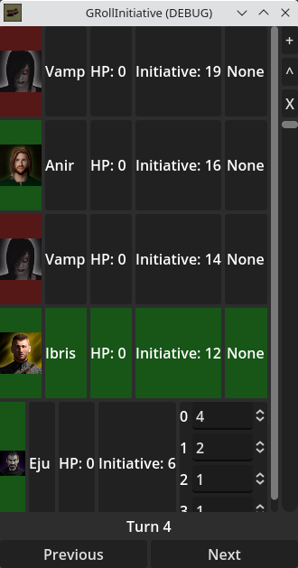

# GRollInitiative

**GRollInitiative** is a initiative tracker made in Godot 4.

## Installation
Simply extract the latest release from [Releases](https://github.com/CamarataM/GRollInitiative/releases), then run 'GRollInitiative.exe'.

## Usage
When opening GRollInitiative, you will see an empty initiative tracker, as no creatures have been added. To add creatures, click the '+' button in the top right.

This is the add / edit creature window. Creatures can be added once given a name. The initiative for the creature can be set. Numbers with decimals are allowed to allow greater control and in the case of a tie. An image for the creature can be set by clicking the avatar circle in the top left.

A color can be associated for the creature, which will be show in the first column and for the highlight of the active creature during the turn. Finally, if you want to save a creature to the Gallery, the down arrow button can be pressed. When either the 'Add' or a creature in the gallery is double clicked, the creature will be added to the main initiative screen.

Delete can be pressed to delete creatures both in the Gallery, while the 'X' button can delete the creature in the tracker.

Double clicking a cell in the tracker allows for editing the value of that cell (such as initiative, the image path, etc).

The 'Previous' and 'Next' buttons control the turn order, going from the highest initiative to the lowest, then wrapping around and incrementing the turn counter.

Gallery creatures are saved to '%appdata%\Godot\app_userdata\GRollInitiative\gallery' on Windows and '~/.local/share/godot/app_userdata/GRollInitiative/gallery' on Linux.

## Screenshots

